Суворова Полина, группа ЛА-1, Лабораторная работа №1

Файл main.cpp в Windows-1251.

g++ -std=c++17 main.cpp -o a.exe
./a.exe

# Суворова Полина, Группа ЛА-1, Лабораторная №1

# Задание 1

## Задача 1

### Текст задачи

Дробная часть.

Дана сигнатура функции: `double fraction(double x);`

Необходимо реализовать функцию таким образом, чтобы она возвращала только дробную часть числа `x`. Подсказка: вещественное число может быть преобразовано к целому путем отбрасывания дробной части.

**Пример:** `x = 5.25` → результат: `0.25`

### Алгоритм решения

1. Принимаем вещественное число `x`.
2. Создаём переменную `whole` и кладём в неё целую часть от `x` — `static_cast<int>(x)`.
3. Вычитаем `whole` из `x` — получаем дробную часть.
4. Возвращаем результат.

**Корректность ввода** проверяем в `main` функцией `ReadDouble()`.

### Тестирование

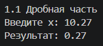

## Задача 2

### Текст задачи

Букву в число.

Дана сигнатура функции: `int charToNum(char x);`

Функция принимает символ `x`, который представляет собой один из `"0 1 2 3 4 5 6 7 8 9"`. Необходимо реализовать функцию таким образом, чтобы она преобразовывала символ в соответствующее число. Подсказка: код символа `'0'` — это число 48.

**Пример:** `x = '3'` → результат: `3`

### Алгоритм решения

1. Принимаем символ `x`.
2. Вычитаем из кода символа `x` код символа `'0'` (48).
3. Возвращаем результат — число, соответствующее цифре.

**Проверка ввода (в `main`):**

1. Запускаем цикл `while (true)`.
2. Запрашиваем символ, читаем в `c`.
3. Очищаем буфер методом `ignore`.
4. Если `c >= '0'` и `c <= '9'` — `c` цифра, выходим из цикла.
5. Иначе — сообщаем об ошибке и повторяем ввод.

### Тестирование

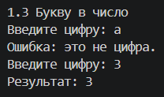

## Задача 3

### Текст задачи

Двузначное.

Дана сигнатура функции: `bool is2Digits(int x);`

Необходимо реализовать функцию таким образом, чтобы она принимала число `x` и возвращала `true`, если оно двузначное.

**Пример 1:** `x = 32` → результат: `true`
**Пример 2:** `x = 516` → результат: `false`

### Алгоритм решения

1. Принимаем число `x`.
2. Если `x < 0` — меняем знак на противоположный (берём модуль).
3. Проверяем, находится ли `x` в диапазоне от 10 до 99.
4. Возвращаем результат проверки (`true` / `false`).

**Корректность ввода** проверяем в `main` функцией `ReadInt()`.

### Тестирование

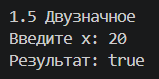
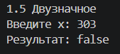

## Задача 4

### Текст задачи

Диапазон.

Дана сигнатура функции: `bool isInRange(int a, int b, int num);`

Функция принимает левую и правую границу (`a` и `b`) некоторого числового диапазона. Необходимо реализовать функцию таким образом, чтобы она возвращала `true`, если `num` входит в указанный диапазон (включая границы). Обратите внимание, что отношение `a` и `b` заранее неизвестно.

**Пример 1:** `a = 5, b = 1, num = 3` → результат: `true`
**Пример 2:** `a = 2, b = 15, num = 33` → результат: `false`

### Алгоритм решения

1. Принимаем три числа: `a`, `b`, `num`.
2. Определяем, какое из чисел `a` и `b` меньше — это `min_val`, а какое больше — `max_val`.
3. Проверяем, находится ли `num` в этом диапазоне.
4. Возвращаем результат (`true` / `false`).

**Корректность ввода** проверяем в `main` функцией `ReadInt()`.

### Тестирование

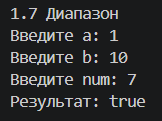
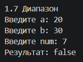

## Задача 5

### Текст задачи

Равенство.

Дана сигнатура функции: `bool isEqual(int a, int b, int c);`

Необходимо реализовать функцию таким образом, чтобы она возвращала `true`, если все три полученных функцией числа равны.

**Пример 1:** `a = 3, b = 3, c = 3` → результат: `true`
**Пример 2:** `a = 2, b = 15, c = 2` → результат: `false`

### Алгоритм решения

1. Принимаем три числа: `a`, `b`, `c`.
2. Проверяем, что `a == b` и `b == c`, из этого следует что `a == c`.
3. Возвращаем результат (`true` / `false`).

**Корректность ввода** проверяем в `main` функцией `ReadInt()`.

### Тестирование

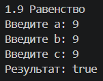
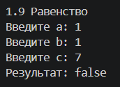

# Задание 2

## Задача 1

### Текст задачи

Модуль числа.

Дана сигнатура функции: `int abs(int x);`

Необходимо реализовать функцию таким образом, чтобы она возвращала модуль числа `x`.

**Пример 1:** `x = 5` → результат: `5`
**Пример 2:** `x = -3` → результат: `3`

### Алгоритм решения

1. Принимаем число `x` типа `int`.
2. Если `x < 0` — возвращаем `-x`.
3. Иначе — возвращаем `x`.

**Корректность ввода** проверяем в `main` функцией `ReadInt()`.

### Тестирование

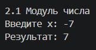
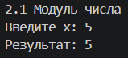

## Задача 2

### Текст задачи

Тридцать пять.

Дана сигнатура функции: `bool is35(int x);`

Необходимо реализовать функцию таким образом, чтобы она возвращала `true`, если число `x` делится нацело на 3 или 5. При этом, если оно делится и на 3, и на 5, то вернуть надо `false`. Подсказка: оператор `%` позволяет получить остаток от деления.

**Пример 1:** `x = 5` → результат: `true`
**Пример 2:** `x = 8` → результат: `false`
**Пример 3:** `x = 15` → результат: `false`

### Алгоритм решения

1. Принимаем число `x`.
2. Проверяем делимость на 3.
3. Проверяем делимость на 5.
4. Если `div3` и `div5` — возвращаем `false`.
5. Иначе — возвращаем `div3 || div5`.

**Корректность ввода** проверяем в `main` функцией `ReadInt()`.

### Тестирование

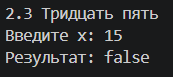
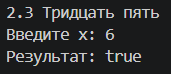

## Задача 3

### Текст задачи

Тройной максимум.

Дана сигнатура функции: `int max3(int x, int y, int z);`

Необходимо реализовать функцию таким образом, чтобы она возвращала максимальное из трех полученных функцией чисел. Подсказка: идеальное решение включает всего две инструкции `if` и не содержит вложенных `if`.

**Пример 1:** `x = 5, y = 7, z = 7` → результат: `7`
**Пример 2:** `x = 8, y = -1, z = 4` → результат: `8`

### Алгоритм решения

1. Принимаем 3 числа типа `int`: `x`, `y`, `z`.
2. Предполагаем, что число `x` самое большое, кладем его в переменную `max_val`.
3. Проверяем, не больше ли число `y` числа в `max_val`, если больше, записываем туда его.
4. Повторяем для `z`.
5. Возвращаем `max_val`.

**Корректность ввода** проверяем в `main` функцией `ReadInt()`.

### Тестирование

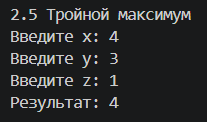

## Задача 4

### Текст задачи

Двойная сумма.

Дана сигнатура функции: `int sum2(int x, int y);`

Необходимо реализовать функцию таким образом, чтобы она возвращала сумму чисел `x` и `y`. Однако, если сумма попадает в диапазон от 10 до 19, то надо вернуть число 20.

**Пример 1:** `x = 5, y = 7` → результат: `20`
**Пример 2:** `x = 8, y = -1` → результат: `7`

### Алгоритм решения

1. Принимаем числа `x` и `y`.
2. Считаем `sum = x + y`.
3. Если `sum` находится в диапазоне от 10 до 19, возвращаем `20`.
4. Иначе — возвращаем `sum`.

**Корректность ввода** проверяем в `main` функцией `ReadInt()`.

### Тестирование

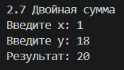
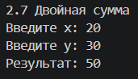

## Задача 5

### Текст задачи

День недели.

Дана сигнатура функции: `String day(int x);`

Функция принимает число `x`, обозначающее день недели. Необходимо реализовать функцию таким образом, чтобы она возвращала строку, которая будет обозначать текущий день недели, где 1 — это понедельник, а 7 — воскресенье. Если число не от 1 до 7, то верните текст "это не день недели". Вместо `if` в данной задаче используйте `switch`.

**Пример:** `x = 5` → результат: `"пятница"`

### Алгоритм решения

1. Принимаем число `x`.
2. Через `switch` сравниваем `x` с числами от 1 до 7:
   - `1` — «понедельник»
   - `2` — «вторник»
   - `3` — «среда»
   - `4` — «четверг»
   - `5` — «пятница»
   - `6` — «суббота»
   - `7` — «воскресенье»
3. Если ни одно не подошло (`default`) — «это не день недели».
4. Возвращаем соответствующую строку.

**Корректность ввода** проверяем в `main` функцией `ReadInt()`.

### Тестирование

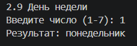
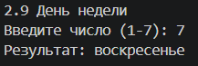

# Задание 3

## Задача 1

### Текст задачи

Числа подряд.

Дана сигнатура функции: `String listNums(int x);`

Необходимо реализовать функцию таким образом, чтобы она возвращала строку, в которой будут записаны все числа от 0 до `x` (включительно).

**Пример:** `x = 5` → результат: `"0 1 2 3 4 5"`

### Алгоритм решения

1. Принимаем число `x`.
2. Создаём пустую строку `result`.
3. Запускаем цикл `for` от 0 до `x` включительно.
4. На каждой итерации преобразуем число `i` в строку и добавляем к `result`, если `i` не последнее (`i < x`) — добавляем пробел.
5. Возвращаем `result`.

**Корректность ввода** проверяем в `main` функцией `ReadInt()`.

### Тестирование

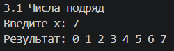

## Задача 2

### Текст задачи

Чётные числа.

Дана сигнатура функции: `String chet(int x);`

Необходимо реализовать функцию таким образом, чтобы она возвращала строку, в которой будут записаны все чётные числа от 0 до `x` (включительно). Подсказка: инструкцию `if` использовать не следует.

**Пример:** `x = 9` → результат: `"0 2 4 6 8"`

### Алгоритм решения

1. Принимаем число `x`.
2. Создаём пустую строку `result`.
3. Запускаем цикл `for` от 0 до `x` с шагом 2 — `i` всегда чётное.
4. На каждой итерации преобразуем число `i` в строку и добавляем к `result`, добавляем пробел.
5. Если строка не пустая — удаляем последний символ (лишний пробел) методом `pop_back()`.
6. Возвращаем `result`.

**Корректность ввода** проверяем в `main` функцией `ReadInt()`.

### Тестирование

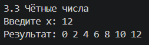

## Задача 3

### Текст задачи

Длина числа.

Дана сигнатура функции: `int numLen(long x);`

Необходимо реализовать функцию таким образом, чтобы она возвращала количество знаков в числе `x`.

**Пример:** `x = 12567` → результат: `5`

### Алгоритм решения

1. Принимаем число `x` типа `long`.
2. Если `x < 0`, берём его модуль через `-x`.
3. Если `x == 0`, возвращаем 1.
4. Если нет — создаём счётчик `count`.
5. Пока `x > 0`, делим `x` на 10 и увеличиваем счётчик на 1.
6. Возвращаем `count`.

**Корректность ввода** проверяем в `main` функцией `ReadInt()`.

### Тестирование

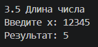

## Задача 4

### Текст задачи

Квадрат.

Дана сигнатура функции: `void square(int x);`

Необходимо реализовать функцию таким образом, чтобы она выводила на экран квадрат из символов `'*'` размером `x`, у которого `x` символов в ряд и `x` символов в высоту.

**Пример 1:** `x = 2` → результат: